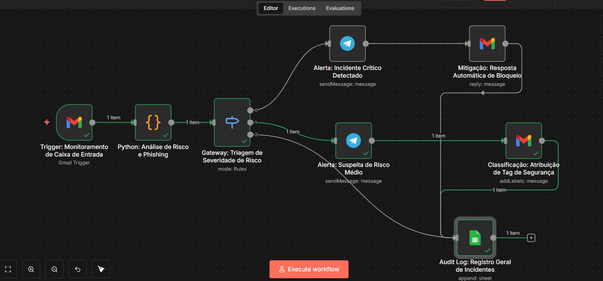

# 🛡️ Sistema de Detecção Automática de Phishing

Projeto de automação para detecção e resposta a tentativas de phishing via email, utilizando n8n, Python e Telegram.

## 📋 Sobre o Projeto

Sistema automatizado que monitora emails recebidos, analisa possíveis ameaças de phishing e envia alertas via Telegram com classificação de risco. Desenvolvido como projeto de estudos em segurança da informação e automação.

## 🚀 Funcionalidades

- ✅ Monitoramento automático de caixa de entrada (Gmail)
- ✅ Análise de risco baseada em múltiplos fatores
- ✅ Detecção de URLs suspeitas
- ✅ Identificação de palavras de urgência
- ✅ Análise de anexos perigosos
- ✅ Alertas automáticos via Telegram
- ✅ Classificação de risco (Alto, Médio, Baixo)
- ✅ Resposta automática de bloqueio para riscos críticos
- ✅ Registro de incidentes em Google Sheets

## 🛠️ Tecnologias Utilizadas

- **n8n**: Plataforma de automação de workflows
- **Python**: Análise e processamento de dados
- **Gmail API**: Monitoramento de emails
- **Telegram Bot API**: Sistema de alertas
- **Google Sheets**: Auditoria e registro

## 📊 Critérios de Análise

### Score de Risco

| Critério | Pontuação |
|----------|-----------|
| Domínios suspeitos (.xyz, .top, .pw, etc) | +40 pontos |
| Palavras de urgência | +20 pontos |
| Anexos perigosos (.exe, .bat, .scr, etc) | +60 pontos |
| Arquivos grandes (>500MB) | +40 pontos |

### Classificação

- 🔴 **ALTO**: Score ≥ 70
- 🟡 **MÉDIO**: Score entre 30-69
- 🟢 **BAIXO**: Score < 30

## 📁 Estrutura do Projeto
```
📦 phishing-detection-n8n/
├── 📄 README.md
├── 📄 analise_phishing.json  # Workflow do n8n (importável)
└── 📄 analise_phishing.py    # Script Python de análise
```

## ⚙️ Como Usar

### Pré-requisitos

- n8n instalado
- Conta Gmail com API habilitada
- Bot do Telegram criado
- Conta Google (para Sheets)

### Instalação

1. **Clone ou baixe este repositório**

2. **Importe o workflow no n8n**
   - Abra o n8n
   - Clique em "Import from File"
   - Selecione o arquivo `analise_phishing.json`

3. **Configure as credenciais**
   - Gmail OAuth2
   - Telegram Bot Token
   - Google Sheets  


## 📸 Demonstração




**Natalia Kikuti**

- LinkedIn: https://www.linkedin.com/in/nataliakikuti/
- Email: nataliakikuti@gmail.com

## 🙏 Agradecimentos

Projeto desenvolvido como parte do aprendizado em segurança da informação e automação de processos.
